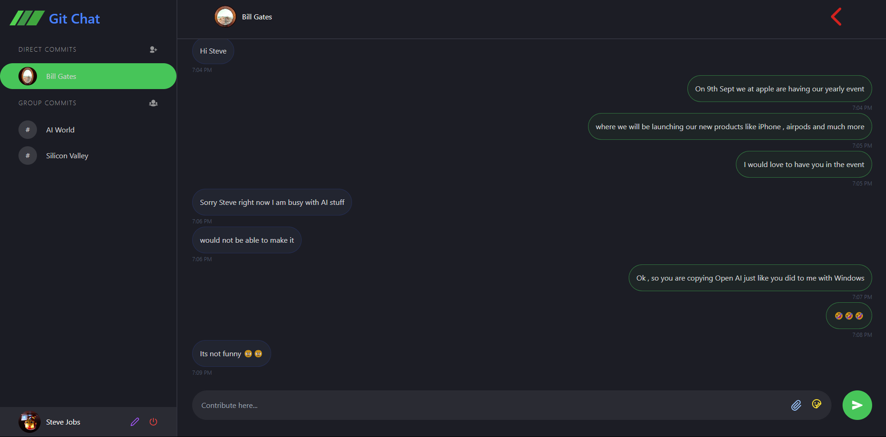

# Git Chat

Git Chat is a live and responsive web application designed for GitHub users to communicate in real time. It leverages modern technologies like React, Node.js, Express, MongoDB, and Socket.io to provide a seamless chat experience.

## Features

- **Real-time Communication**: Messages are delivered instantly using Socket.io, with a 30% reduction in latency.
- **Responsive Design**: Built with Tailwind CSS, ensuring a responsive and user-friendly interface with a 10% improvement in responsiveness.
- **Scalable Data Storage**: Utilizes MongoDB for efficient data retrieval and scalability, improving data access speed by 15%.
- **Secure Authentication**: Integrated JSON Web Tokens (JWT) for secure user authentication and session management, enhancing data protection and user privacy.

## Technologies Used

- **Frontend**: React
- **Backend**: Node.js, Express
- **Database**: MongoDB
- **Styling**: Tailwind CSS
- **Real-time Communication**: Socket.io
- **Authentication**: JSON Web Tokens (JWT)

## Installation



To run Git Chat locally, follow these steps:

 **Clone the Repository**

   ```bash```
   git clone https://github.com/yourusername/git-chat.git

   cd git-chat
   # For Frontend 
  cd client
  npm install

   # For Backend 
   cd ../server
   npm install
   
   
   Create a .env file in the server directory with the following variables:
   
   MONGODB_URI=<your_mongodb_connection_string>
   JWT_SECRET=<your_jwt_secret_key>
   PORT=5000
   Replace <your_mongodb_connection_string> with your MongoDB connection string and <your_jwt_secret_key> with a secure secret key for JWT.
   
   Start the Application
   
   Start the Backend Server:
   
   cd server
   npm start
   Start the Frontend Development Server:
   
   Open a new terminal window:
   
   cd client
   npm start
   Access the Application
   
   Open your browser and navigate to http://localhost:3000 to access the Git Chat application.

# Contributing
Feel free to submit issues or pull requests if you have suggestions or improvements for Git Chatt.

# License
This project is licensed under the MIT License. See the LICENSE file for details.

# Contact
For any questions or feedback, please reach out to aalvya.pandey@gamil.com or Visit : https://www.alavyapandey.com/
